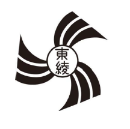

# 足立区立東綾瀬小学校PTA 規約
更新日：２０２４年１２月１６日

## 第１章 名称

### 第１条
本会は足立区立東綾瀬小学校ＰＴＡと称し、事務所を足立区東綾瀬２－１５－１５ 足立区立東綾瀬小学校 に置く。

## 第２章 目的

### 第２条
この会は保護者と教職員とが協力し、学校と家庭と地域社会に於ける児童の幸福な成長を図ることを目的とする。

### 第３条
この会は前条の目的を達成するためにつぎの活動を行う。
1. よりよい保護者、よりよい教職員となるよう努める活動
2. 子どもたちのために積極的に遊びや集団行動の指導をする活動
3. 会員のために必要な報道及び調査をし、文化向上を図る活動

## 第３章 方針

### 第４条
この会は、教育を本旨とする社会教育団体であり、宗教的・政治的活動には関与しない。また、学校の管理運営及び学校人事には一切干渉しない。

## 第４章 会員

### 第５条
この会の会員となることのできるものは次のとおりであり、また会員はすべて平等の権利と義務を有する。
1. 本校に在学する児童の保護者またはこれに代わる者、および本校教職員
2. 顧問およびこの会の主旨に賛同する者

### 第６条
この会へは自由意志で入会し、また退会できる。 この会の退会は次のとおりとする。
1. 自動退会：子の卒業・転校によって会員資格を消滅する場合（退会届は不要）
2. 任意退会：転居または自由意志によって退会する場合（退会届を提出する）
3. 未払退会：入会後に明確な理由なく会費が支払われず、未納が一年継続した場合（一年とは、初回会費引落し日から翌年の同日までを指す）

## 第５章 会計

### 第７条
この会の活動に要する経費は、会費、寄付金及びその他の収入によって、これをまかなう。

### 第８条
この会の会費は次のとおりとする。
1. １世帯につき、年額 3,000 円（月額 250 円）とする。
2. 会費額については、総会の決議により変更することができる。
3. 会費は、定められた口座から自動振替による一括納入とする。
4. 転入については、転入月から翌年３月までの会費を徴収する。
5. 転出については、会費の返還はしないものとする。
6. 総会において事情を承認された会員は、会費を減額又は免除する場合がある。

### 第９条
この会の会計年度は、毎年 4 月 1 日に始まり、翌年 3 月 31 日に終わる。

### 第１０条
この会の経理は、総会において決議された予算に基づいて行われ、決算はすべて会計監査を経て総会に報告され、承認を得なければならない。

### 第１１条
この会の資産は、PTA 本部・PTA 主催の事業及び共同事業に使用するものであり、規約第２条の目的以外に使用してはならない。

## 第６章 役員

### 第１２条
この会に次の役職を置く。 但し、会員総意のもとで増減できるものとする。
1. 会長 1 名
2. 副会長 ２名以上
3. 書記 ２名以上
4. 会計 ２名以上
5. 会計監査 2 名

### 第１３条
役員は、原則役員会ならびに書面（電磁的記録媒体も含む）によって選出される。但し、教職員の役員選出については、学校長に一任するものとする。

### 第１４条
役員の任期は 2 年間とする。教職員はこの限りではない。但し、再選・再任を妨げない。
1. 役員は、定期総会において選任され、委員総会当日に就任する。
2. 役員に欠員を生じた時は、速やかに補充しなければならない。
3. 欠員補充は役員会で選出し、会員へ報告する。

### 第１５条
役員の任務は次のとおりとする。
1. 会長は、この会を代表し会務を統括する。また総会および各会を召集し、会議を主宰する。
2. 副会長は、会長を補佐し、会長に事故あるときはその代理を務める。
3. 書記は、各会の議事を記録保管するとともに、会長の指示に従いこの会の庶務を行う。
4. 会計は、この会の財産を管理し、総会が決定した予算に基づいて一切の会計事務を処理する。
5. 会計監査は、この会の経理を監査し、その結果を総会に報告する。

## 第７章 集会

### 第１６条
この会の集会は、下記のとおりとする。 集会は紙面等での実施も可能とする。
1. 総会（定期総会 及び 臨時総会）
2. 本部役員会
3. 運営委員会
4. 各専門委員会
5. その他研修・教養などのための集会

### 第１７条
総会は、この会の最高議決機関であり、種類及び内容は次のとおりとする。
1. 定期総会は、毎年度初めに対面または書面で開催され、予算・決算・役員承認・規約改正など、総会権限とされる事項を審議し、議決を行う。
2. 臨時総会は、会長及び本部役員会で必要と認めたとき、または全会員の３分の１以上の要請のあったときに開催する。
3. 総会は、全会員の２分の１以上の出席で成立する。但し、議決権行使兼委任状も認める。
4. 総会の決議は、全会員の過半数をもって決定し、賛否同数の場合は議長が決定する。なお、書面（電磁的記録媒体を含む）による投票行為も決議の対象に含める。また、未回答や白票は同意に含むものとする。

### 第１８条
本部役員会は、役員により構成され、会務の重要事項全般について審議し、かつ運営委員会において審議されるべき事項を決定することを任務とする。

### 第１９条
運営委員会は、役員及び各専門委員会の正副委員長で構成し、必要に応じて適宜開催する。

### 第２０条
各専門委員会は、全委員及び教職員で構成し、必要に応じて適宜開催し、所属する委員の意見をまとめ、活動に反映させる。

## 第６章 顧問

### 第２１条
顧問は、歴代校長、歴代会長を含め会長がこれを委嘱する。任期は本人の辞任の意思のない限り継続する。

## 第７章 付則

### 第２２条
この会の活動に必要な付則及び内則は、この規約に反しない限り本部役員会が定める。

## 第８章 個人情報の取り扱い

### 第２３条
この会が活動を推進するために必要とする会員の個人情報の取得、利用、提供及び管理については、細則に定める「個人情報取扱規程」により適正に運用するものとする。

## 第９章 慶弔見舞金規程

### 第２４条
会員ならび教職員に対して支給する慶弔見舞の種類は、次のとおりとする。
1. 教職員が転任・退職する場合の記念品
2. 死亡弔慰金
3. 傷病見舞金
4. その他必要と認められた慶弔金および見舞金

## 第１０章 改正

### 第２５条
この会の規約変更は、総会の決議による。但し、改正案については、本部役員会で審議決定する。

### 第２６条
この規約は、２０２５年６月１日改正より実施する。
２０１８年３月１０日一部改正
２０２０年７月１日 一部改正
２０２３年５月２６日一部改正
２０２５年６月１日 一部改正

以上